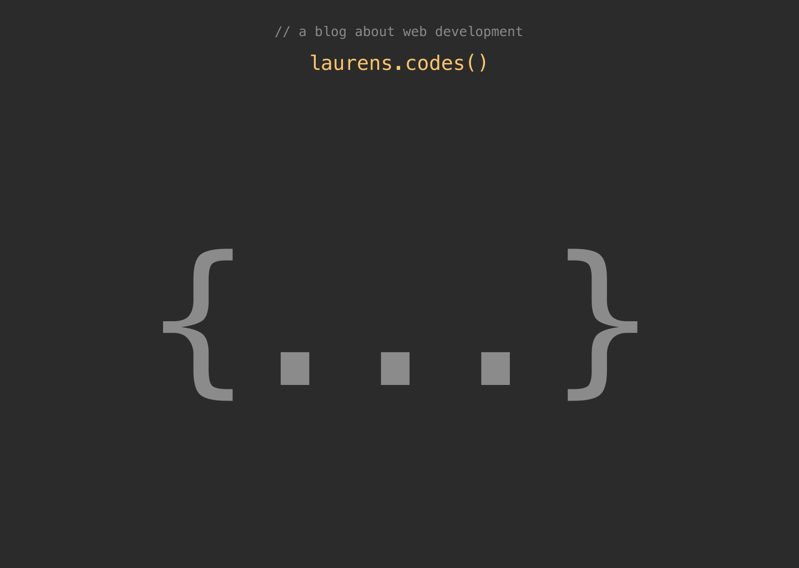
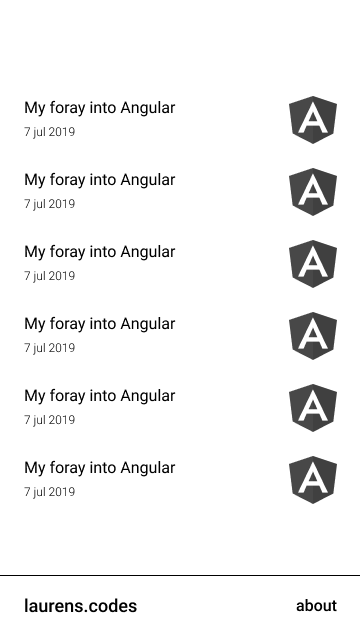
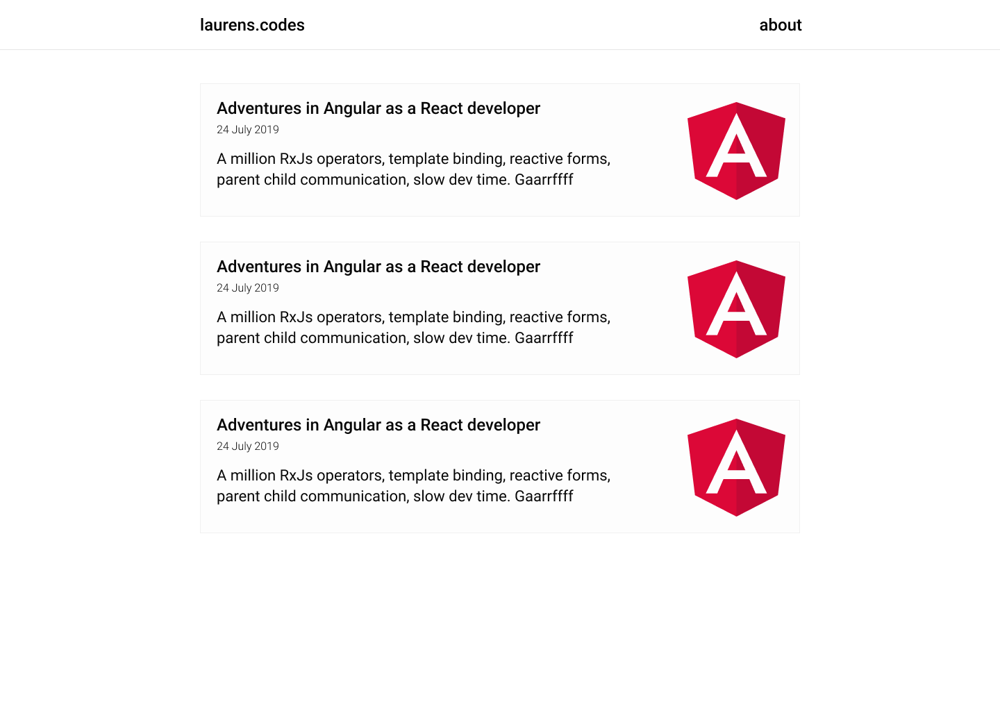
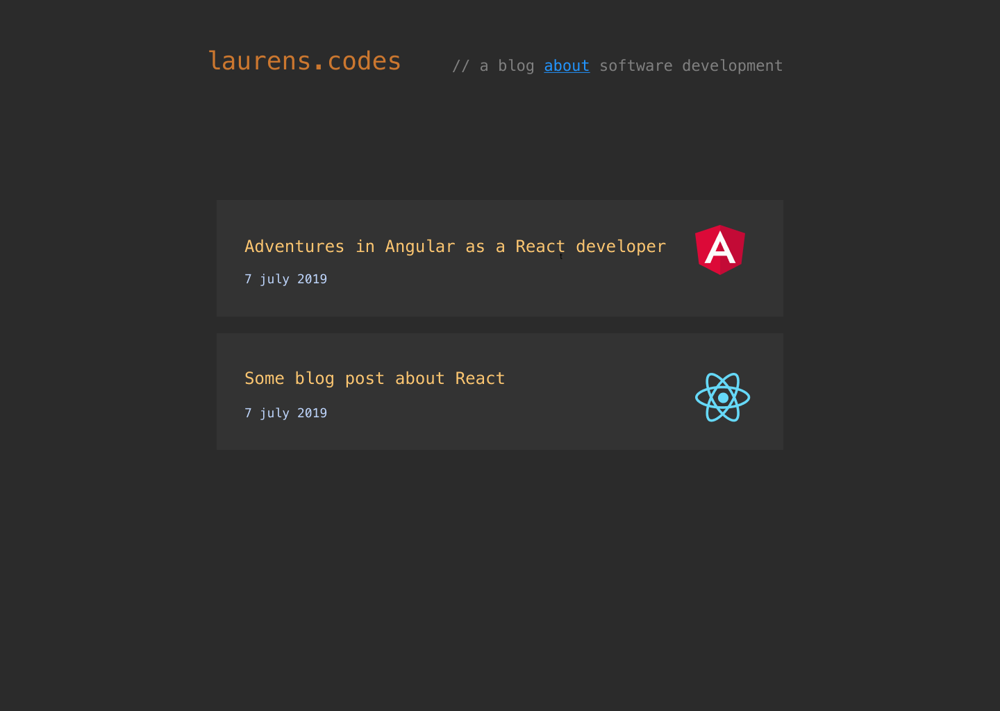
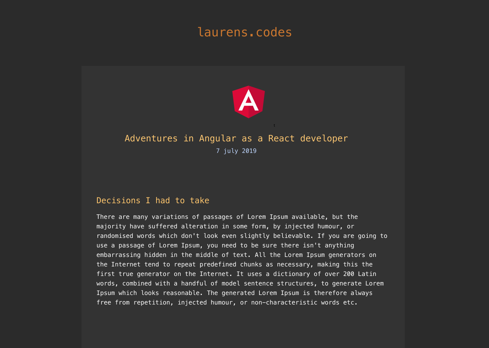
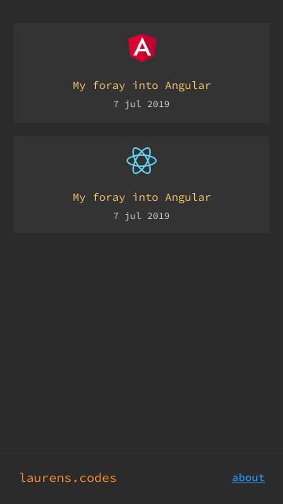

# The creation of my blog, aka my own static site generator


## What

I wanted a blog where I could post my code learnings.
It needed to be as simple as possible, but also perform reasonably well.
My **requirements**:

- I only want to write content, thus automating everything else.
- Images need to be responsive.
- Inline the article svg.
- Make it an SPA. This is a nice to have.

## How

There's tons of tools available to make blog websites.
However, if you're a developer, especially a frontend developer, I'm of the opinion that you have to build it yourself. That leaves out WordPress and the likes.

Then there's great stuff available for building blogs with modern js frameworks, such as [Gatsby](https://www.gatsbyjs.org/).
It's quick and easy (if you're proficient in those frameworks).
But, it comes with a bunch of client side Javascript that is totally unnecessary.

Then there's Hugo, Jekyll, and the one that fits my needs the most, [eleventy](https://www.11ty.io/docs/).

The thing is, sometimes I feel like I'm constantly having to learn new APIs instead of actually coding. I'm tired of digging into documentation to make the thing do what I want it to do. For **simple enough stuff** like a blog, I'd much rather do it all myself.

## Design

Let's not forget design. I'm a noob but love to tinker with it.

LOL


I envisioned these brackets to slide open and go to the sides when first visiting the page.
Almost went with these next ones (without the ugly AF brackets though), but it didn't feel simple enough.




In an attempt to make it simple and clean, I made these. They're suuuuper boring though.




Ah, these feel semi alright.





I felt the colors were off a bit, and something else didn't feel quite right. So I went over to a discord UI channel to ask for feedback. They rightfully pointed out that I should not use a dark theme for large chunks of text. So I changed it to the current design you're viewing now 🙂.

## Code

Initially, I started out in bash because I wanted to learn it. It quickly turned out to be too time consuming. Perl or Python would be much better candidates for the job. I decided to with what I already know, Javascript.

To quote my friend:

> A good developer is a developer who gets things done.

### Implementing the requirements

#### I should only worry about writing content

Everyone and everything is using Markdown to write their content at the moment, so I went with it. This means writing my content in `.md` files and then converting them to HTML.

However, looking back on my decision, I'm not quite convinced.

Pros of writing markdown:

- I, as a frontend developer, do not have to concern myself with cumbersome HTML tags 😄.
- Euh...

Cons:

- I have to write scripts to convert the .md files to .html. Conversion can do unwanted things. I do not know how the package ([showdownjs](https://github.com/showdownjs/showdown)) works.
- I had to learn a syntax I wasn't completely familiar with. I referenced this [markdown cheat sheet](https://github.com/adam-p/markdown-here/wiki/Markdown-Cheatsheet) constantly (How much traffic would this repo get? 🤔😃).

#### Images need to be responsive

This means creating 4 versions of each image. Mobile, mobile webP, desktop, desktop webP.
After creation, optimize the images.

#### Inline the main article svg

This means you have no extra network request fetching the image. It's not the right technique if you use the same svg frequently.

#### Make it a single page app

This means, when you're on the index page, and you click on a blogpost, you don't want to load another external recourse (blogpost.html), thus refreshing the page. Or the other way around (blogpost -> index).

How I would do it:

- Replace all the anchor tags with functions with simple js.
- Create a blogposts.json that contains all the needed information to construct the heading and content of a blogpost.
- Lazy load that file on the initial load.
- When you click on a blogpost on the index.html page, delete all other blogposts with js, read the needed content from the blogposts.json file and inject it into the html.

### After the fact

A walkthrough and some code snippets:

- Ask the user the filename of the markdown file to convert, the keywords of the blogpost, and a description.

```javascript
function getFile() {
  return new Promise(async (resolve, reject) => {
    try {
      const { filename } = await prompts({
        type: "text",
        name: "filename",
        message: `Enter the draft blogpost filename that's ready (without extension)`
      });

      const file = `../content_draft/${filename}.md`;
      if (!fs.existsSync(file)) {
        throw new Error(`${filename}.md not present in ./content_draft`);
      }

      resolve({ file, filename });
    } catch (e) {
      reject(e);
    }
  });
}
```

- Convert the markdown file.

```javascript
function convertMarkdownToHtml(markdown) {
  const converter = new showdown.Converter({
    noHeaderId: true,
    headerLevelStart: 2
  });
  const html = converter.makeHtml(markdown);
  return runPrettierOnHtml(html);
}
```

- Extract the created date, title and images from the html file.

```javascript
function extractCreatedDate(file) {
  const { birthTime } = fs.statSync(file);
  return moment(birthTime).format("YYYY-MM-DD");
}

const title = markdownConversionHtml.match(/<h2>\n?(.*)\n?<\/h2>/)[1];

function findAllImages(html) {
  const foundImagesWithCapturingGroups = [
    ...html.matchAll(//g)
  ];
  return foundImagesWithCapturingGroups;
}
```

- Create 4 versions of the same image for responsiveness.

```javascript
function resizeAndCreateWebp(inputPath, outputPath, webPOutputPath, width) {
  return new Promise((resolve, reject) => {
    sharp(inputPath)
      .resize({ width })
      .toFile(outputPath)
      .then(_ => {
        sharp(outputPath)
          .webp({ lossless: true })
          .toFile(webPOutputPath)
          .then(_ => {
            resolve({
              originalFormat: outputPath,
              webP: webPOutputPath
            });
          })
          .catch(e => {
            reject(e);
          });
      })
      .catch(e => {
        reject(e);
      });
  });
}
```

- Optimize those images

```javascript
function optimizeImages(images) {
  const svgImages = images.filter(image => /svg$/.test(image));
  const jpegImages = images.filter(image => /jpe?g$/.test(image));
  const pngImages = images.filter(image => /png$/.test(image));
  const webPImages = images.filter(image => /webp$/.test(image));

  const destination = "../website/assets/images";

  const promises = [
    imagemin(svgImages, { destination, plugins: [imageminSvgo({})] }),
    imagemin(jpegImages, { destination, plugins: [imageminJpegtran()] }),
    imagemin(pngImages, {
      destination,
      plugins: [imageminPngquant({ strip: true })]
    }),
    imagemin(webPImages, {
      destination,
      plugins: [imageminWebp({ quality: 80 })]
    })
  ];

  return new Promise((resolve, reject) => {
    Promise.all(promises)
      .then(f => {
        console.log("Optimization successful");
        resolve();
      })
      .catch(e => {
        reject(e);
      });
  });
}
```

- Create a blogpost.html file and the blogpost article html for injecting into the index.html
  P.S.: Code shows only the genericHTML (used for index and blogpost.html), the code sample would be too big otherwise.

```javascript
function getGenericHtml(description, keywords, title, content, isIndexPage) {
  const codeHighlightingCss = `
    <link 
        href="https://cdnjs.cloudflare.com/ajax/libs/prism/1.17.1/themes/prism-okaidia.min.css" 
        rel="stylesheet" 
    />`;

  const codeHighlightingJs = `
    <script 
        async 
        src="https://cdnjs.cloudflare.com/ajax/libs/prism/1.17.1/prism.min.js">
    </script>
    `;

  return `
    <!--
    check out the code at:
    https://github.com/laurensdewaele/blog
    -->
    <!DOCTYPE html>
    <html lang="en">
    <head>
        <meta charset="utf-8" />
        <meta name="author" content="Laurens Dewaele" />
        <meta name="description" content="${description}" />
        <meta name="keywords" content="${keywords}" />
        <!--    TODO: Set theme color-->
        <meta name="theme-color" content="" />
        <meta name="color-scheme" content="normal" />
        <meta name="robots" content="index,follow" />
        <meta name="viewport" content="width=device-width, initial-scale=1" />
        <link href="./assets/css/styles.css" rel="stylesheet">
        ${isIndexPage ? "" : codeHighlightingCss}
        <title>${title}</title>
    </head>
    <body>
        <nav>
            <a href="./index.html"><h1>laurens.codes</h1></a>
        </nav>
        <main>
            ${content}
        </main>
        <footer>
            <p>
                a blog <a href="./about.html">about</a> software development
            </p>
        </footer>
        ${isIndexPage ? "" : codeHighlightingJs}
    </body>
    </html>
    `;
}
```

- Save blogpost into a blogposts.json file. This for eventually adding a SPA feel to the website and for rebuilding the html after you change the generic html.

```javascript
const blogpost = {
  title,
  keywords,
  description,
  filename,
  articleHtml: minify(articleHtml),
  articleHeaderHtml: minify(articleHeaderHtml)
};

const blogs = getBlogs();
blogs.push(blogpost);
writeBlogsToJSON(blogs);
```

Full code is available @ [github](https://github.com/laurensdewaele/blog).
