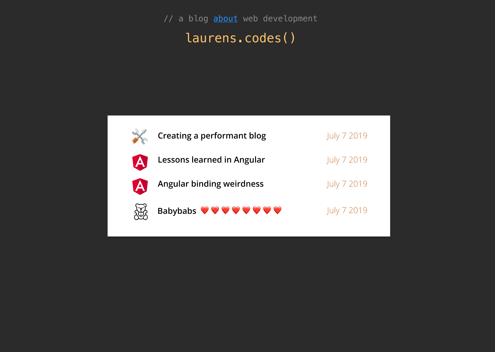
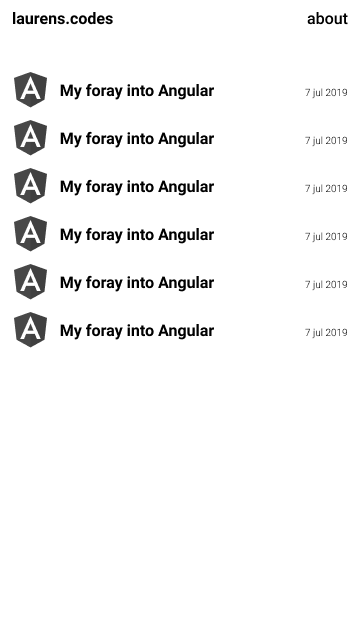
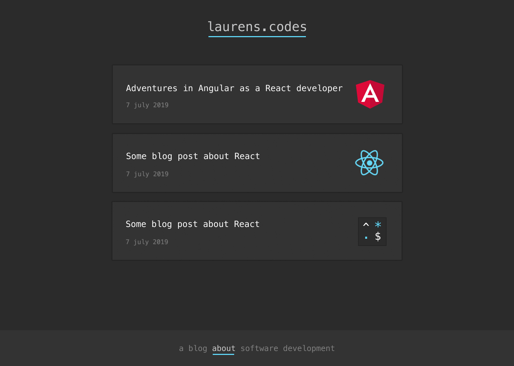
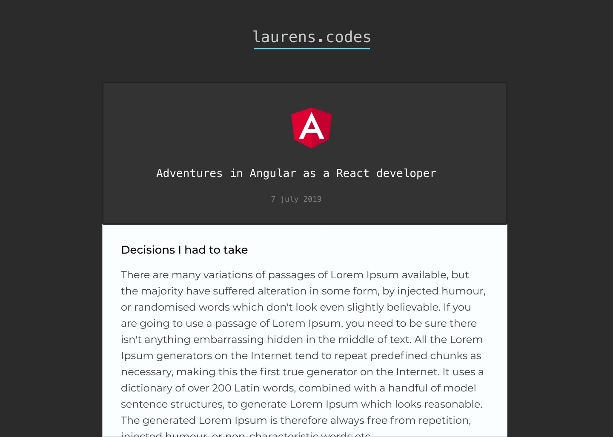
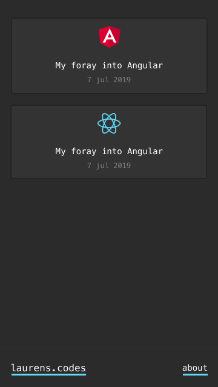

# Building the blog aka my own static site generator

## Tools

You can make perfectly fine blogs with WordPress or some other tool.
However, imo, if you're a **frontend** developer, you have to make it yourself from scratch. And no, not with React or Gatsby. Pick the right tool for the job. This is a blog. I mean, come on 😅.

I wanted my blog to be as simple as possible, for me to write content and deploy.
I was wondering whether it would make sense to write my blogs in markdown instead of html. I chose markdown, however, looking back, I'm not entirely convinced.

### Pros

- I, as a frontend developer, will not have to concern myself with cumbersome html tags 😀.
- Euh... Ah right, I can easily write stuff down on any device. Well, not really.

### Cons

- Have to write scripts to convert the .md files to .html.
- Conversion can do things that I did not intend to. I do not know the inner workings of the program (showdown) that does it.
- I had to learn a syntax I was not 100% familiar with. I opened the [cheat sheet](https://github.com/adam-p/markdown-here/wiki/Markdown-Cheatsheet) constantly. How much traffic would this repo get? 🤔😃

Looks like I made the wrong choice.
Oh well, I have time, and scripting is fun.

## Design

I love this stuff, but I'm a noob.

LOL 😁

Asked for some pointers on discord for this last design. They rightfully pointed out that I should not use a dark theme for large chunks of text. Also I did not like the colors. Quick fix.

## Requirements

### Must haves

- Have a draft folder for unfinished blog posts.
- Create a separate blogpost.html file.
- Inject the title, blog post svg and creation date into the index.html.
- All referenced images should be optimized. This means creating a mobile, desktop and webP version of the same image and then compressing it.
- Svg should be inlined for speed (no extra network request).

### Nice to haves

- Making it so that it feels like an SPA with simple js.

Oh boy, Alright, let's do this.

## Code

I started to code in bash, for learning, but this will take me way too long. I'm doing it in node.
To quote a friend of mine:

> A good developer is a developer who gets things done.

Done blogging now, check out the code on github.

## After the fact

I took longer than i thought.
Why did i feel i had to code it myself (instead of using something like eleventy)?

- I'd rather code than learning new APIs
- This is a personal website that people, e.g. potential hires will see. It must be decent.
