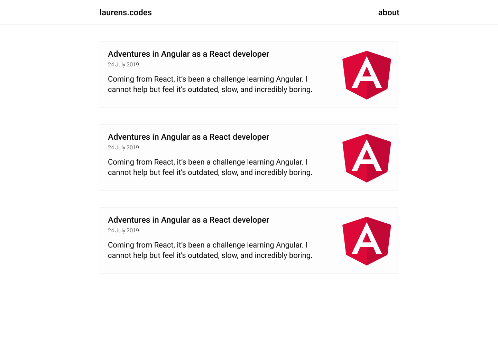

# The creation of my blog, aka my own static site generator

## What

I wanted a blog where I could post my code learnings.
It needed to be as simple as possible, but also perform reasonably well.
My **requirements**:

- I only want to write content, thus automating everything else.
- Images need to be responsive.
- Svg's need to be inlined.
- Make it an SPA. This is a nice to have.

## How

### Tooling

There's tons of tools available to make blog websites.
However, if you're a developer, especially a frontend developer, I'm of the opinion that you have to build it yourself. That leaves out WordPress and the likes.

Then there's great stuff available for building blogs with modern js frameworks, such as [Gatsby](https://www.gatsbyjs.org/).
It's quick and easy (if you're proficient in those frameworks).
But, it comes with a bunch of client side Javascript that is totally unnecessary.

Then there's Hugo, Jekyll, and the one that fits my needs the most, [eleventy](https://www.11ty.io/docs/).
The thing is, I feel like I'm constantly having to learn new APIs instead of actually coding. I'm tired of digging into documentation to make the thing do what I want it to do.

For **simple enough stuff** like a blog, I'd much rather do it all myself.

## Design

Let's not forget design. I'm a noob but love to tinker with it.

LOL

I envisioned these brackets to slide open and go to the sides when first visiting the page.
Almost went with these next ones (without the ugly AF brackets though), but it didn't feel simple enough.

In an attempt to make it simple and clean, I made these. They're suuuuper boring though.

Ah, these feel semi alright.

I felt the colors were off a bit, and something else didn't feel quite right. So I went over to a discord UI channel to ask for feedback. They rightfully pointed out that I should not use a dark theme for large chunks of text. So I changed it to the current design you're viewing now 🙂.

## Code

Initially, I started out in bash because I wanted to learn a new language. It quickly turned out to be too time consuming. Perl and Python are much better candidates for the job. I decided to skip my own advice of picking the right tool for the job, and going with what I know already, Javascript.

To quote my friend:

> A good developer is a developer who gets things done.

### Implementing the requirements

#### I should only worry about writing content

Everyone and everything is using Markdown to write their content at the moment, so I went with it. This means writing my content in `.md` files and then converting them to HTML.

However, looking back on my decision, I'm not quite convinced.

Pros of writing markdown:

- I, as a frontend developer, do not have to concern myself with cumbersome HTML tags 😄.
- Euh...

Cons:

- I have to write scripts to convert the .md files to .html. Conversion can do unwanted things. I do not know how the package ([showdown](https://github.com/showdownjs/showdown)) works.
- I had to learn a syntax I wasn't completely familiar with. I referenced this [markdown cheat sheet](https://github.com/adam-p/markdown-here/wiki/Markdown-Cheatsheet) constantly (How much traffic would this repo get? 🤔😃).

#### Images need to be responsive

This means creating 4 versions of each image. Mobile, mobile webP, desktop, desktop webP.
After creation, optimize the images.

#### Svg's need to be inlined

This means you have no extra network request fetching the image. It's not the right technique if you use the same svg frequently.

#### Make it a single page app

This means, when you're on the index page, and you click on a blogpost, you don't want to load another external recourse (blogpost.html), thus refreshing the page. Or the other way around (blogpost -> index).

How I would do it:

- Replace all the anchor tags with functions
- Create a blogposts.json that contains all the needed information to construct the heading and content of a blogpost
- Lazy load that file on the initial load.
- When you click on a blogpost on the index.html page, delete all other blogposts with js, read the needed content from the blogposts.json file and inject it into the html.

### After the fact

A walkthrough of the code:

- Ask the user the filename of the markdown file to convert, the keywords of the blogpost, and a description.
- Convert the markdown file.
- Extract the created date, title and images from the html file.
- Create 4 versions of the same image for responsiveness.
- Optimize those images
- Create a blogpost.html file
- Create the blogpost article html for injecting into the index.html
- Save blogpost into a blogposts.json file. This for eventually adding a SPA feel to the website and for rebuilding the html if you want to change the generic html.

I feel this blogpost is already quite lengthy, check out the code if you want to at [github](https://github.com/laurensdewaele/blog).
