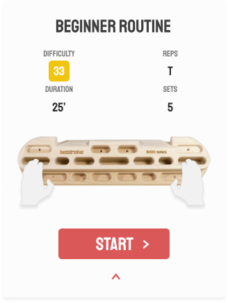
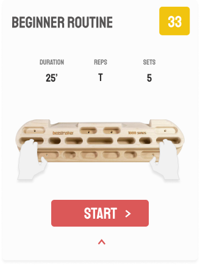

# Custom expansion tile / card / accordion in Flutter


## What I wanted

When designing the app, I did not really take into account what kind of card transition animations should occur.

I had these two card states:

Collapsed:


Expanded:



Going from one to the other means I have to:

- Center my title
- Do something with the yellow '33'
- Increase the size of the card and display the content, just like any other accordion.

## Solutions

### Redesign 

Animating all that seemed like a lot of work.
So I designed something else:

Refactored expanded card:



This way I don't have to animate my title and do something with that yellow '33'.

However, I does not look pretty compared to my first design, so I tossed the idea.

I'm glad I did not account for this when first designing, because I'm of the principle that you should design with total creative freedom, not by implementation constraints. Every design is possible to be implemented by code. It's just a matter of time (thus money in most cases). If it cannot be done within the time constraints, than iterate on the design, but please let the first design be made without all this in mind 🙂.

### Code all the animations

What I wanted:


In the first collapsed state, the title and the difficulty rating are located at the start and end of the container.
In the second expanded state, the title is located in the center, and the difficulty rating is gone.

I decided to animate both to the right, where the title would be in the middle and the difficulty rating would be invisible, or, off screen.

Initially, for the collapsed state, I used `MainAxisAligment.spaceBetween` to separate the two widgets.
However, you cannot do anything with that if you need to transition the title to the middle.

So I needed to implement the Align widget.
```Dart
Row(children: [
	Align(
		alignment: Alignment(-1, 0),
      	child: Text('Beginner routine')
  	),
  	Align(
  		alignment: Alignment(1,0),
  		child: Difficulty()
  		)
])
```

Problem with this is that, when I center the title `Alignment(0,0)`, the container will not take up the full width because of the space that the difficulty box consumes.

So... 
I needed a Stack widget.

**1st layer** of the stack:
 - title 
 - empty box that has the same dimensions as the difficulty widget (because I don't want extra long text to paint behind it)

**2nd layer**:
 - the difficulty widget

Okay!
So all I need to do is: 

  1. Change the alignment from the title from (-1,0) to (0,0).
  2. Animate the empty box from it's original size to 0. This in order for the title container to take up full width.
  3. Move the difficulty widget off screen.
  4. Expanded the size of the card container and display the content

I had some trouble to implement the last one.
I couldn't figure out what to use, or what height to set, because I didn't want to use absolute values.
There was no `height: auto` or anything.

Thank god I finally found out about the [ExpansionTile widget](https://github.com/flutter/flutter/blob/1aedbb1835/packages/flutter/lib/src/material/expansion_tile.dart#L30) and with that as an example, the rest was easy.

[Finished code](https://github.com/laurensdewaele/hangboard_app/blob/master/app/lib/widgets/workout_overview_card.dart)


